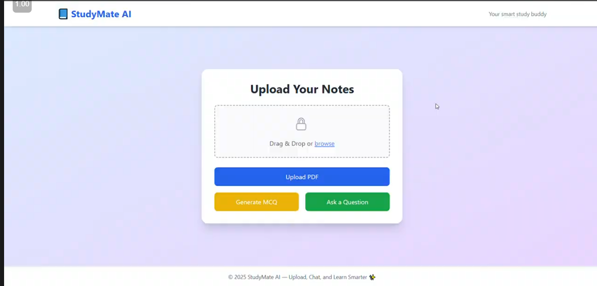

# 📚 AI-Powered Learning Assistant

🚀 **Project Overview:**  
This AI-powered learning assistant helps students interact with their notes efficiently. Users can upload their notes, ask questions, and generate MCQs based on their content.

## ✅ Implemented Features:

1️⃣ **📤 Upload Notes:** Students can upload their notes in text format.  
2️⃣ **❓ Q&A System:** Users can ask questions, and the AI retrieves answers based on their notes.  
3️⃣ **📝 MCQ Generation:** The system generates multiple-choice questions (MCQs) from the uploaded content to aid in self-assessment.  

## 🔄 Work in Progress:

🚧 **📝 Handwritten Notes Processing**  
- Experimented with open-source OCR models, but results were not satisfactory.
- Testing with **Azure AI OCR** is pending, as it provides better accuracy at a lower cost compared to AWS and Tesseract.

🚧 **📖 Book Portion Analysis**  
- Implementing a feature where students can select specific portions of their books for AI analysis and recommendations.

## 🛠️ Tech Stack:

- **Frontend:** ⚛️ React.js
- **Backend:** 🚀 FastAPI
- **GenAI Framework:** 🧠 LangChain
- **LLM Model:** 🦙 LLaMA 3.2
- **Vector Database:** 🏪 ChromaDB

## 🔜 What's Next?

🔹 Integration of **Azure AI OCR** for handwritten note extraction.  
🔹 Enabling students to highlight book portions for analysis.  
🔹 Enhancing AI-generated MCQs for better assessment quality.  

## 🎥 Project Demo  
🔗 **Watch the demo video here:** 

Stay tuned for updates! 🚀📖✨